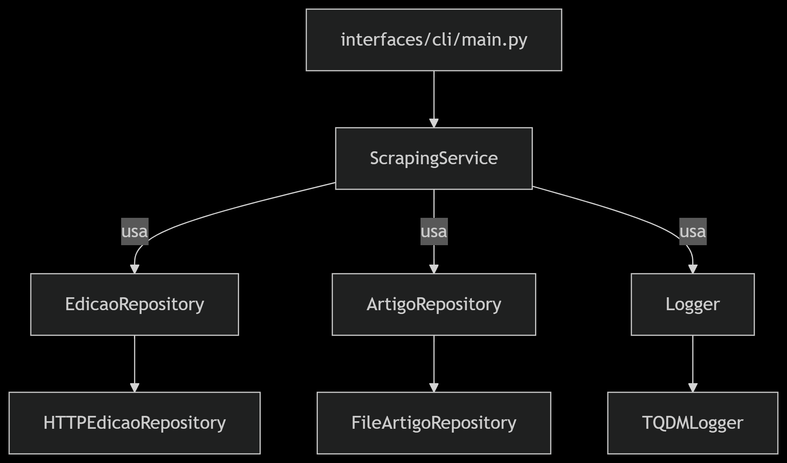
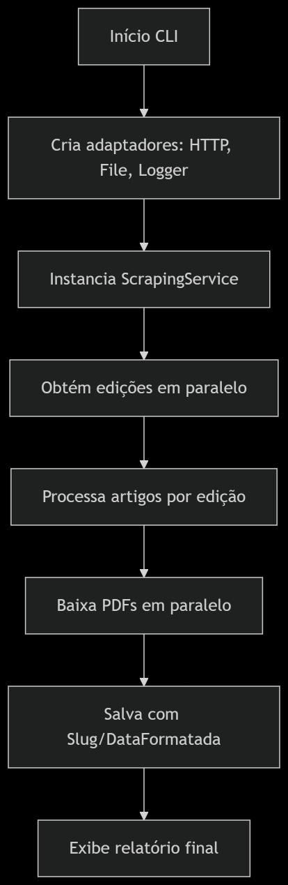

# Scraping de Artigos Científicos - PROLAM/USP

Este projeto realiza o scraping de artigos científicos da revista PROLAM da USP, organizando-os por data de publicação. A aplicação segue os princípios de Domain-Driven Design (DDD) e Arquitetura Hexagonal para garantir uma estrutura limpa, testável e de fácil manutenção.

## 📂 Estrutura do Projeto

```bash
scrapping_BJLAS/
├── core/                    # Lógica central de negócio
│   ├── domain/             # Modelos de domínio
│   │   ├── entities.py         # Entidades (Artigo, Edição)
│   │   ├── value_objects.py    # Objetos de valor (Slug, DataFormatada)
│   │   └── repositories.py     # Interfaces de repositório
│   ├── application/        # Casos de uso
│   │   └── scraping_service.py  # Serviço de scraping
│   └── ports/              # Portas de entrada/saída
│       └── logger_port.py       # Interface de logging
├── infrastructure/         # Implementações concretas
│   ├── adapters/           # Adaptadores para serviços externos
│   │   ├── http_edicao_repository.py   # Adaptador HTTP
│   │   ├── file_artigo_repository.py   # Adaptador de arquivos
│   │   └── tqdm_logger.py            # Adaptador de logging
│   └── config.py           # Configurações globais
├── interfaces/             # Pontos de entrada da aplicação
│   └── cli/
│       └── main.py             # Script principal
├── tests/                  # Testes unitários automatizados
│   └── test_scraping_service.py
├── requirements.txt        # Dependências do projeto
├── LICENSE                 # Licença MIT
└── README.md               # Documentação
```

## 🔧 Instalação e Execução

### Requisitos

- Python 3.10 ou superior

### Passos

```bash
# Clone o repositório
git clone https://github.com/seu-usuario/projeto_scraping.git
cd scrapping_BJLAS

# Instale as dependências
pip install -r requirements.txt

# Execute o script principal
python interfaces/cli/main.py
```

## ⚙️ Configurações

Arquivo: `infrastructure/config.py`

```python
DOWNLOAD_DIR = "pdfs_prolam"
MAX_THREADS = 50
TIMEOUT = 15
URLS = [
    "https://revistas.usp.br/prolam/issue/archive",
    "https://revistas.usp.br/prolam/issue/archive/2"
]
```

## 🧠 Arquitetura Hexagonal


## 🧠 Princípios de Design

- **DDD (Domain-Driven Design)**

  - Entidades: `Artigo`, `Edicao`
  - Objetos de Valor: `Slug`, `DataFormatada`
  - Repositórios: `ArtigoRepository`, `EdicaoRepository`

- **Inversão de Dependência**

  - Domínio independe de infraestrutura
  - Aplicação injeta portas (repositórios e loggers)

- **Testabilidade**

  - Tudo que depende de IO está adaptado e pode ser mockado facilmente

## 🚀 Fluxo de Execução


## 📄 Exemplo de Saída

```text
[14:30:25] ⚡ Coletando edições em modo turbo...
[14:30:26] ✅ 50 edições detectadas
[14:30:26] ⚡ Extraindo artigos em paralelo...
Processando: 100%|██████████| 50/50 [00:05<00:00, 10.00edição/s]
[14:30:31] 🚀 523 artigos preparados para download
[14:30:31] ⚡ Iniciando downloads paralelos...
Baixando: 100%|██████████| 523/523 [00:35<00:00, 14.90PDF/s]

============================================================
🏁 DESEMPENHO FINAL
• Edições processadas: 50
• Artigos encontrados: 523
• Downloads concluídos: 523
• Tempo total: 40.21 segundos
• Velocidade: 13.0 artigos/segundo
🔥 Taxa de transferência estimada: 32.5 MB/s
============================================================
```

## 🧪 Testes Automatizados

```bash
# Executar todos os testes
pytest
```

### Arquivo de exemplo

- `tests/test_scraping_service.py`: cobre os fluxos de sucesso, falha por tipo de conteúdo e exceção em edição.

## 🌟 Benefícios da Arquitetura

- **Manutenibilidade**: camadas desacopladas
- **Testabilidade**: camadas centrais independentes de framework
- **Escalabilidade**: fácil adicionar banco, cache, UI web
- **Clareza**: separação de responsabilidades clara

## 🚨 Melhorias Futuras

- Interface web com FastAPI
- Cache de edições e artigos
- Dashboard com estatísticas
- Banco de dados para metadados
- Monitoramento com Prometheus
- Upload automatizado para S3 ou GDrive

